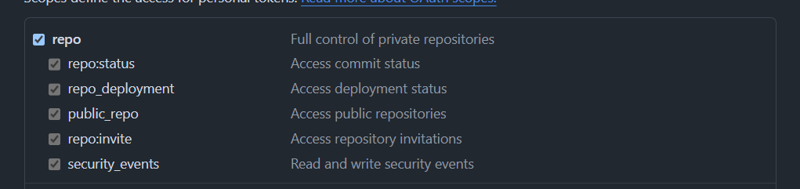

# Fake Commit Github

## About this repository

- This project is used to fake commits on github according to the time stamp you want.
- I made this project just for fun hehe ^^

## Install

- Install `python`
- Download this repository [Download](https://github.com/shr3wcl/fake-git-commit/archive/refs/heads/main.zip)
- Install all of library: `pip install -r requirements.txt`
- Run it with command: `python app.py`
- Enjoy it ^^

## How to get the `GITHUB_TOKEN`

To get a Personal Access Token (PAT) from GitHub, you need to follow these steps. This token will allow you to perform actions on GitHub via the API, such as creating new repositories, pushing code, and more depending on the permissions you grant the token.

- **Step 1**: Log in to GitHub
- Open your browser and log in to your GitHub account at github.com.

- **Step 2**: Go to Settings
- Once logged in, click on your avatar in the upper right corner of the screen, then select Settings from the drop-down menu.

- **Step 3**: Go to [Developer settings](https://github.com/settings/apps)
- In the settings page, scroll down to the bottom and select Developer settings at the bottom of the page, located in the section for advanced customizations.
- **Step 4**: [Personal Access Tokens](https://github.com/settings/tokens)
- In the left menu of Developer settings, select Personal access tokens. Then click the Generate new token button in the upper right corner of the list of existing tokens (if any).
- **Step 5**: Create Token [New Token](https://github.com/settings/tokens/new)
- Give your token a name in the Note field so that it can be easily identified for future use.
- Select an expiration time for the token in the Expiration section. You can choose from "No expiration" to a certain time like 30 days, 90 days, etc.
- Select the permissions (scopes) you want to grant to the token. To create and manage repositories, make sure you have selected repo. You may also need to add other permissions depending on the operations you plan to perform via the API.
- 
Click Generate token.
- **Step 6**: Copy the Token
- Once the token is generated, GitHub will show it to you only once. Be sure to copy this token and save it safely. You cannot view the token after leaving this page.
- Use this token instead of a password when accessing GitHub via the API or command line tools.

## Support me

- If you find this project interesting, you can invite me for a cup of coffee ^^

